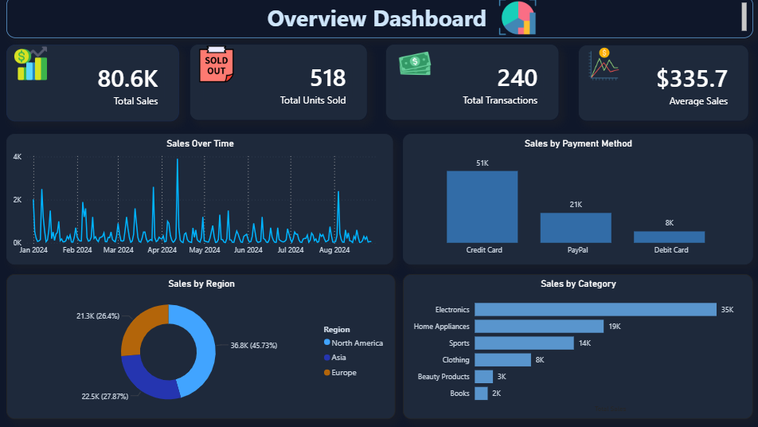
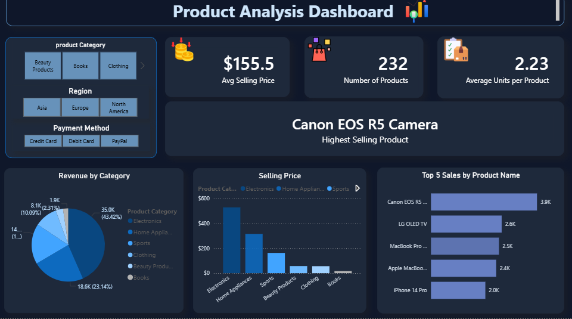
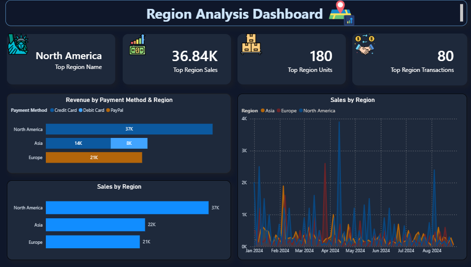

# Sales Analysis Dashboard

## 📌 Project Overview

Interactive Power BI dashboard designed to analyze sales performance, product trends, and regional insights using business intelligence techniques.

---

## 🛠 Tools Used

- Power BI
- Power Query
- DAX

---

## 📊 Dashboard Pages

### 📈 Overview Dashboard

### 📦 Product Analysis Dashboard

### 🌍 Region Analysis Dashboard

---

## 📌 Key Insights

- Monitored overall sales performance using dynamic KPIs.
- Analyzed product performance across different categories.
- Compared regional sales performance to identify top-performing markets.
- Created interactive dashboards to support data-driven decision-making.
